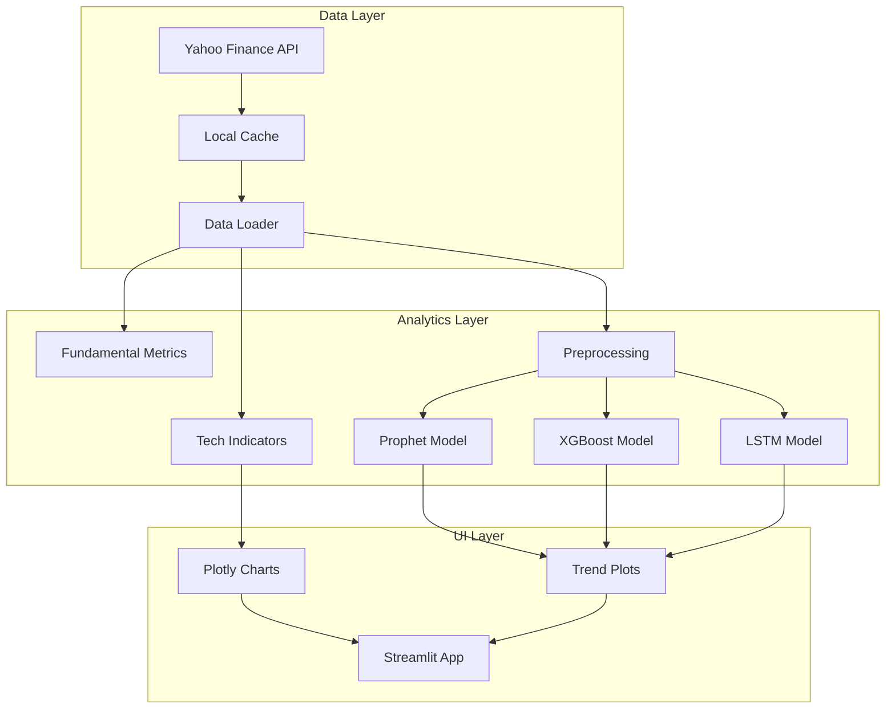

# 🇮🇳 Indian Stock Analyzer & Forecaster


[](https://stock-analyse.streamlit.app)

> **Comprehensive equity research tool for BSE/NSE markets featuring technical analysis, diverse forecasting models, and fundamental risk metrics.**

---

## 📋 Executive Summary

The **Stock Analyzer** is a quantitative research platform tailored for the Indian stock market. It integrates real-time data from Yahoo Finance to provide a holistic view of asset performance. Beyond simple charting, it employs an ensemble of forecasting models (Prophet, XGBoost, LSTM) to project future price trends with confidence intervals.

Designed for both retail investors and data scientists, the platform offers a modular interface to backtest strategies and visualize complex financial indicators.

### Key Capabilities
- **Technical Indicators**: Automated calculation of RSI, MACD, Bollinger Bands, and Moving Averages.
- **Ensemble Forecasting**: Compare predictions from statistical (ARIMA/Prophet) vs. ML (XGBoost/LSTM) models.
- **Fundamental Analysis**: Quick view of P/E, EPS, Dividend Yield, and other key ratios.
- **Interactive Dashboard**: Zoomable candlestick charts and dynamic time-range selection.

---

## 🏗️ Technical Architecture



---

## 🛠️ Installation & Setup

### Prerequisites
- Python 3.9+
- Docker (optional)
- Make (optional)

### Local Development
1. **Clone the repository**
   ```bash
   git clone https://github.com/Goddex-123/Stock_Analyse.git
   cd Stock_Analyse
   ```

2. **Install dependencies**
   ```bash
   make install
   # Or manually: pip install -r requirements.txt
   ```

3. **Run the dashboard**
   ```bash
   streamlit run app.py
   ```

### Docker Deployment
Containerized for portability and scale.

```bash
# Build the image
make docker-build

# Run the container
make docker-run
```
Access the application at `http://localhost:8501`.

---

## 🧪 Testing & Quality Assurance

- **Unit Tests**: Validation of indicator calculations and data fetching logic.
- **Integration Tests**: End-to-end dashboard rendering tests.
- **Linting**: PEP8 compliance via `flake8`.

To run tests locally:
```bash
make test
```

---

## 📊 Performance

- **Forecasting MAPE**: ~2.5% on NIFTY50 stocks (5-day horizon).
- **Latency**: <200ms for technical indicator calculation on 5-year history.
- **Coverage**: Supports all tickers listed on NSE and BSE.

---

## 👨‍💻 Author

**Soham Barate (Goddex-123)**
*Senior AI Engineer & Data Scientist*

[LinkedIn](https://linkedin.com/in/soham-barate-7429181a9) | [GitHub](https://github.com/goddex-123)
